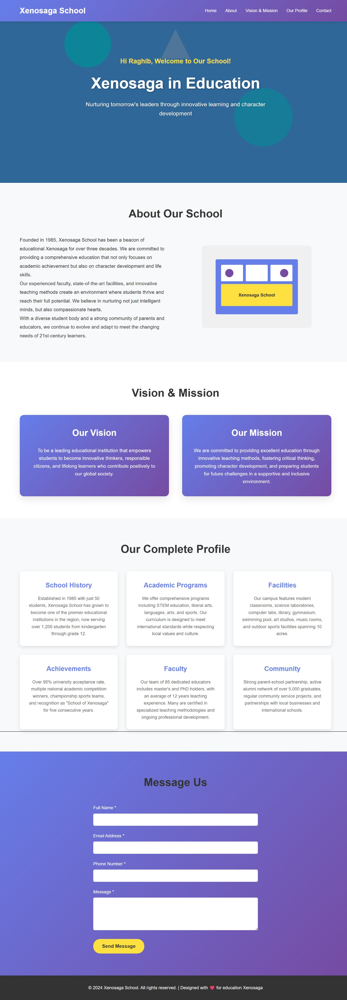

# 🌟 Website Portfolio Sekolah - Xenosaga School
Website ini merupakan portfolio digital dari **Xenosaga School**, dirancang untuk menyampaikan informasi sekolah secara interaktif dan profesional, mencakup profil, visi misi, fasilitas, dan formulir kontak.

## 🔧 Fitur Utama
- **Hero Slider Otomatis**: Menampilkan 3 slide dengan pesan utama sekolah.
- **Responsive Navigation**: Navigasi dinamis dan mobile-friendly.
- **Tentang Sekolah**: Seksi “About” dengan layout 2 kolom.
- **Visi & Misi**: Tampilkan dengan card gradient interaktif.
- **Profil Lengkap**: Grid informasi seperti sejarah, program, prestasi, dll.
- **Form Kontak Validasi**: Formulir dengan validasi client-side dan notifikasi real-time.
- **Desain Responsif**: Optimal di berbagai perangkat.

## 🖥️ Struktur File
- `index.html` : Struktur utama website (digunakan `school_portfolio_website.html`)
- Inline `<style>` dan `<script>`: CSS dan JavaScript ditanam langsung untuk kemudahan satu file.

## ✨ Interaksi JavaScript
- **Slider Otomatis** setiap 4 detik
- **Prompt Nama Pengunjung** saat load awal halaman
- **Navigasi Dinamis** antar halaman "Home" dan "Profile"
- **Validasi Form**: Nama, email, telepon, dan pesan
- **Preview Data** hasil form submission

## 🎨 Desain & Warna
- **Warna Utama**: Gradasi ungu-biru `#667eea → #764ba2`
- **Warna Aksen**: Kuning terang `#fee140`
- **Font**: Arial dengan clean modern look
- **Layout**: Flexbox dan Grid dengan padding dan margin proporsional

## 📱 Mobile Friendly
- Menu Hamburger untuk layar kecil
- Responsive layout pada `768px` dan `480px`
- Typography dan spasi menyesuaikan ukuran layar

## 🧠 Skill & Teknologi
- **HTML5 Semantik**
- **CSS3 Advanced**: Grid, Flexbox, Media Queries
- **JavaScript DOM & Event Handling**
- **Form Validation**
- **UX Enhancement**: Feedback & interaktivitas

## 🚀 Cara Menjalankan

### Melalui Browser
1. Buka file `school_portfolio_website.html` dengan browser Anda

### Server Lokal (opsional)
```bash
# Dengan Python
python -m http.server 8000

# Dengan PHP
php -S localhost:8000
```

## 🖼️ Screenshot


## 📬 Kontak
Jika Anda memiliki pertanyaan atau ingin berkontribusi:
* **Email**: [raghibbasmallah@gmail.com](mailto:raghibbasmallah@gmail.com)
* **GitHub Issues**: Kirim issue di repository ini

## 📄 Lisensi
Proyek ini dibuat untuk tujuan pembelajaran dan pengembangan portofolio. Bebas digunakan, disesuaikan, dan disebarluaskan untuk edukasi.

**Dibuat dengan ❤️ untuk Xenosaga School**

*Last updated: Juni 2025*
